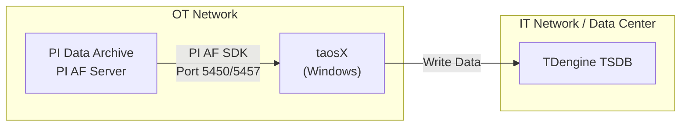
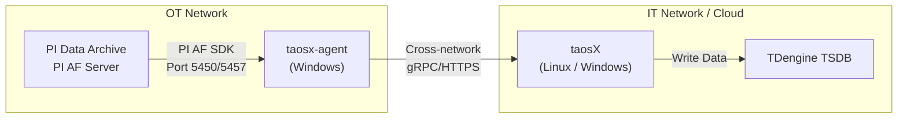
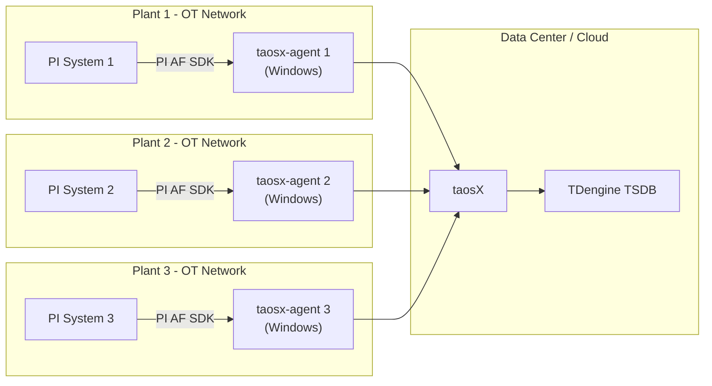

This page describes the deployment architecture options for the PI connector, helping you choose the appropriate deployment plan based on your actual network environment.

## 1. Architecture Overview

The PI connector is a taosX plugin responsible for reading data from the PI system and writing it to TDengine. Its core dependency is **PI AF SDK** (Windows only), so the connector must run on a Windows host that can directly connect to the PI system.

The connector can run in two modes:

| Mode | Description |
| ---- | ----------- |
| Embedded in taosX | taosX itself is deployed on a Windows host that can directly connect to the PI system; the connector runs as a built-in taosX plugin |
| Via taosx-agent proxy | taosX is deployed elsewhere (e.g., cloud or IT data center); the PI system is accessed through taosx-agent as a proxy |

## 2. Option A: taosX Direct Connection

**Applicable scenario**: taosX can be deployed directly on a Windows server in the same network segment as the PI system.

**Advantages**:

- Simple architecture, no additional agent deployment needed
- Low operational cost

**Limitations**:

- taosX must run on Windows
- The taosX host must be able to reach both the PI system and TDengine

## 3. Option B: Agent Proxy Mode (Recommended)

**Applicable scenario**: taosX is deployed in the cloud or IT data center and cannot directly connect to the PI system; or the PI system is located in an isolated OT network.

**Advantages**:

- taosX can be deployed on Linux, free from the Windows-only limitation of PI AF SDK
- Complies with OT/IT network segmentation security requirements
- The agent only needs network connectivity in two directions: to the PI system and to taosX

**Limitations**:

- Requires additional deployment and maintenance of taosx-agent
- The Windows host running the agent must have PI AF SDK installed

:::tip
Agent proxy mode is the **recommended deployment option for production environments**, especially suitable for industrial scenarios with OT/IT network isolation.
:::

## 4. Option C: Multi-PI System Aggregation

**Applicable scenario**: Enterprise-level deployment where multiple plants each have independent PI systems, and data needs to be aggregated into a unified TDengine cluster.

**Advantages**:

- Unified management of data from multiple PI systems
- Each plant deploys its own agent independently, without affecting others
- Facilitates enterprise-level data analysis and monitoring

**Considerations**:

- Each agent needs to independently install PI AF SDK and configure access permissions for the corresponding PI system
- We recommend using different TDengine databases or supertable prefixes for data from different plants to avoid naming conflicts

## 5. Agent Deployment Key Points

If you chose Option B or Option C, here are the key points for taosx-agent deployment:

| Key Point | Description |
| --------- | ----------- |
| Operating System | Must be Windows (PI AF SDK only supports Windows) |
| PI AF SDK | PI AF SDK (PI AF Client 2018+) must be installed on the agent host |
| Service Account | The Windows service account running the agent must have PI system access permissions |
| Network - PI Side | agent → PI Data Archive (port 5450), agent → PI AF Server (port 5457) |
| Network - taosX Side | agent ↔ taosX network connectivity (gRPC/HTTPS) |
| Installation | Click **+Create New Agent** in Explorer to get the agent installation guide |

## 6. Architecture Selection Decision Table

| Condition | Recommended Option |
| --------- | ------------------ |
| taosX can be deployed on a Windows host in the same network segment as the PI system | Option A (Direct Connection) |
| taosX is in the cloud or IT network, PI is in the OT network | Option B (Agent Proxy) |
| Multiple PI systems across plants need to be aggregated into one TDengine | Option C (Multi-PI Aggregation) |
| Strict OT/IT network isolation with security compliance requirements | Option B or C (Agent Proxy) |
| Want taosX to run on Linux | Option B or C (Agent Proxy) |
