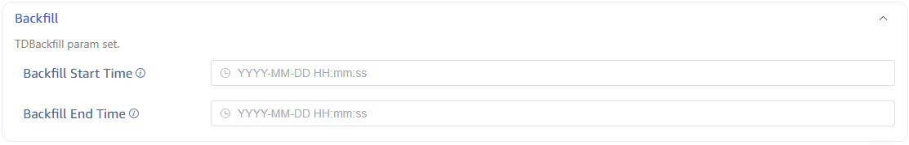
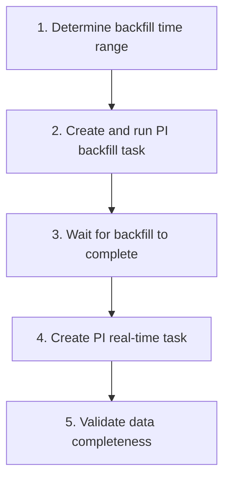
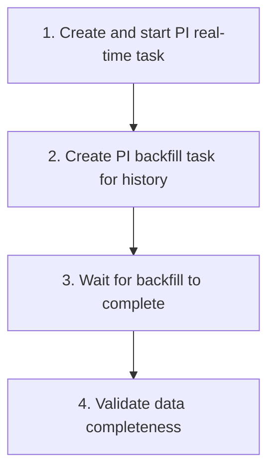

This page describes how to use PI backfill tasks to migrate historical data from the PI system to TDengine, covering task creation, performance optimization, migration workflow, and data validation.

## 1. Overview

PI backfill tasks extract historical data from the PI system within a specified time range and write it to TDengine. Typical use cases include:

- **System migration**: Migrating from the PI system to TDengine, requiring historical data to be migrated as well
- **Data recovery**: Backfilling data gaps caused by task interruptions or other reasons
- **Data analysis**: Importing historical data into TDengine for retrospective analysis

## 2. Creating a PI Backfill Task

### 2.1 Basic Steps

1. On the Data In page in Explorer, click **+Add Data Source**
2. In the **Type** dropdown, select **PI backfill**
3. Configure connection information (same as real-time tasks, see [main documentation](./index.md))
4. Configure data model (single/multi-column, see [Model Configuration Reference](./03-csv-reference.md))
5. Configure the backfill time range (see next section)
6. Submit the task

### 2.2 Configure Backfill Time Range

PI backfill tasks **must** have the following parameters configured:

| Parameter | Description |
| --------- | ----------- |
| Start Time | The starting time point for backfilling data |
| End Time | The ending time point for backfilling data |



:::note
The backfill task will automatically stop after completing the data migration for the specified time range.
:::

## 3. Performance Optimization

### 3.1 Batch Size Tuning

In **Advanced Options**, you can adjust the batch size, which affects the amount of data written to TDengine per operation:

| Scenario | Suggested Batch Size | Description |
| -------- | -------------------- | ----------- |
| Default | Use system default | Suitable for most scenarios |
| Many points, data-intensive | Increase appropriately | Improves throughput but uses more memory |
| Memory-constrained | Decrease appropriately | Reduces memory usage but may reduce throughput |

### 3.2 Parallel Backfill Strategy

For migrating large volumes of historical data, we recommend splitting into multiple backfill tasks by time segments for parallel execution:

| Strategy | Description |
| -------- | ----------- |
| Split by year/month | Split the entire backfill time range into multiple tasks by year or month |
| Split by data source | Use independent backfill tasks for different templates or point groups |
| Control concurrency | Monitor the load on the PI system and TDengine to avoid too many parallel tasks |

**Example**: Backfilling data from 2020-01-01 to 2024-12-31

```text
Task 1: 2020-01-01 ~ 2020-12-31
Task 2: 2021-01-01 ~ 2021-12-31
Task 3: 2022-01-01 ~ 2022-12-31
Task 4: 2023-01-01 ~ 2023-12-31
Task 5: 2024-01-01 ~ 2024-12-31
```

:::tip
When running parallel backfill tasks, monitor the PI Data Archive Server load to avoid excessive concurrent reads affecting the normal operation of the PI system.
:::

### 3.3 Performance Impact on the PI System

Backfill tasks read large volumes of historical data from the PI Data Archive, which may have the following impact on the PI system:

- Increased CPU and I/O load on the PI Data Archive
- Increased network bandwidth usage

**Mitigation measures**:

- Execute backfill during low-load periods of the PI system (e.g., nights, weekends)
- Control the number of parallel tasks
- Control the read rate through the batch size parameter

## 4. Recommended Migration Workflow

### 4.1 Backfill First, Then Real-time (Recommended)

This is the most common migration workflow, suitable for most scenarios:



**Key points**:

- In step 4, when creating the real-time task, configure an appropriate **restart compensation time** to cover the interval between backfill completion and real-time task startup, ensuring no data loss during the transition
- In step 5, we recommend comparing data volumes between PI and TDengine, and spot-checking data accuracy

### 4.2 Real-time First, Then Backfill

Suitable for scenarios where real-time data sync needs to start as soon as possible:



**Key points**:

- TDengine performs updates (overwrites) for data with the same timestamp, so overlapping time periods between real-time and backfill tasks will not produce duplicate data
- The advantage of this approach is that real-time data has no delay; the disadvantage is higher load on both the PI system and TDengine during backfill

## 5. Data Validation

After backfill is complete, the following validations are recommended:

### 5.1 Data Volume Comparison

Query the data volume for the same time range in both PI and TDengine to confirm consistency:

```sql
-- TDengine: Query data volume for a table within the backfill time range
SELECT COUNT(*) FROM <table_name>
WHERE ts >= '2020-01-01' AND ts < '2025-01-01';
```

### 5.2 Data Accuracy Spot Check

Select several points/elements and compare data values at specific timestamps between PI and TDengine.

### 5.3 Timestamp Alignment

Confirm that timestamps in TDengine match the original timestamps in PI, paying special attention to timezone issues.

## 6. FAQ

### How to resume after a backfill task interruption?

PI backfill tasks support checkpoint-based resumption. If a task is interrupted, restarting it will continue from the last interruption point, and already-written data will not be reprocessed.

### Batching strategy for large-scale point backfill?

If you need to backfill data for tens of thousands of points, we recommend:

1. Split into multiple tasks by template/point group
2. Use independent model configuration files for each task
3. Start in batches, monitoring PI system load

### How to troubleshoot slow backfill speed?

1. Check if network bandwidth is a bottleneck
2. Check the CPU and I/O load on the PI Data Archive
3. Check if TDengine write is a bottleneck
4. Try adjusting the batch size parameter
5. Set the log level to `debug` for detailed information
