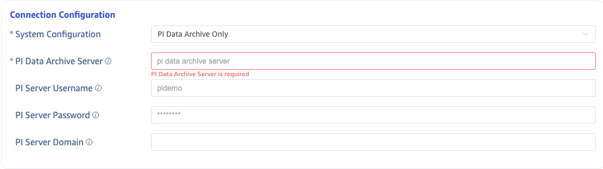
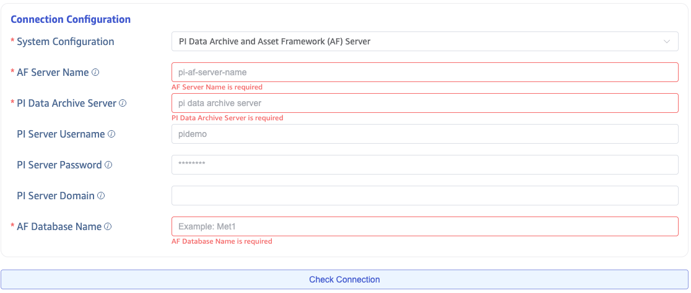
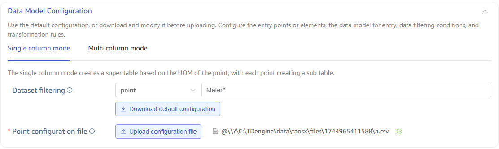
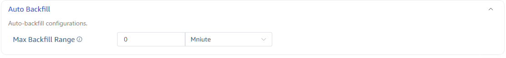
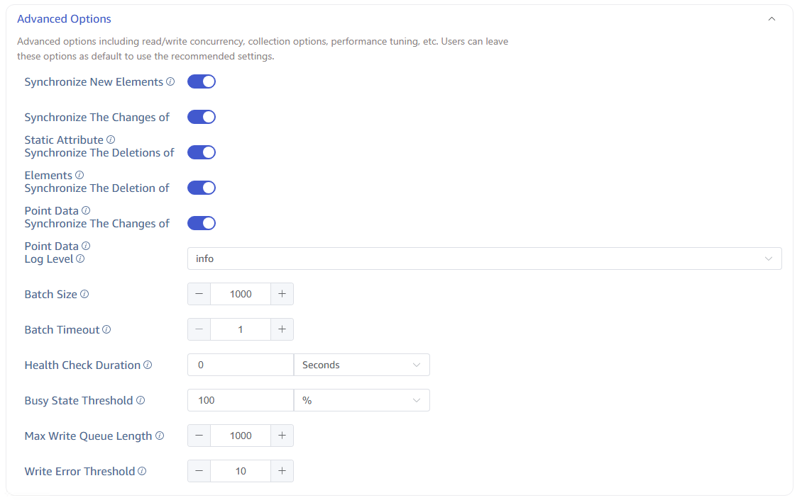

import { Enterprise } from '../../../assets/resources/_resources.mdx';

<Enterprise/>

This section describes how to create data migration tasks through the Explorer interface, migrating data from the PI system to the current TDengine TSDB cluster.

## Feature Overview

The PI System (OSIsoft PI System) is a software product suite used for data collection, retrieval, analysis, delivery, and visualization, widely used in power, petrochemical, manufacturing, and other industries. It serves as enterprise-level infrastructure for managing real-time data and events.

taosX extracts real-time or historical data from the PI system through the PI connector plugin and writes it to TDengine TSDB.

### Task Types

From the data timeliness perspective, PI data source tasks are divided into two categories:

| Task Type | Name in Explorer | Description |
| --------- | ---------------- | ----------- |
| Real-time Task | **PI** | Continuously subscribes to real-time data changes in the PI system and writes to TDengine |
| Backfill Task | **PI backfill** | Extracts historical data within a specified time range and writes to TDengine |

### Data Models

From the data model perspective, PI data source tasks are divided into **single-column model** and **multi-column model**:

| Data Model | Mapping Rule | Use Case |
| ---------- | ------------ | -------- |
| Single-column Model | One PI Point → One TDengine subtable | Point-centric data collection |
| Multi-column Model | One PI AF Element → One TDengine subtable | Device/asset-centric data collection |

### Data Source Types

From the connected data source type perspective:

| Data Source Type | Supported Data Models | Description |
| ---------------- | --------------------- | ----------- |
| PI Data Archive Only | Single-column model only | Connects directly to PI Data Archive Server |
| PI Data Archive + AF Server | Single-column and multi-column models | Connects via PI AF SDK, supports full asset framework |

Users define the data mapping rules from PI to TDengine through a CSV-format **model configuration file**. For details, see [Model Configuration File Reference](./03-csv-reference.md).

## Data Ingestion

### 1. Verify Prerequisites

Before starting, verify that your PI system environment meets the [prerequisites](./01-prerequisites.md), including:

- Network reachability to PI Data Archive / AF Server
- Firewall rules allowing ports 5450 and 5457
- PI AF SDK installed on the taosX or agent host
- Service account configured with appropriate PI access permissions

If this is your first deployment, we recommend reading [Deployment Architecture](./02-deployment-architecture.md) to understand the recommended deployment options.

### 2. Add New Data Source

On the Data In page, click the **+Add Data Source** button to enter the new data source page.

### 3. Configure Basic Information

Enter a task name in the **Name** field, for example: `pi-realtime-plant1`.

In the **Type** dropdown, select **PI** (real-time task) or **PI backfill** (backfill task).

**Agent** configuration: The PI connector depends on PI AF SDK, so taosX or its agent (taosx-agent) must be deployed on a **Windows** host that can directly connect to the PI system.

- If taosX itself runs on a Windows server that can directly connect to the PI system, the **Agent** is not required.
- If taosX is deployed in the cloud or another environment that cannot directly connect to the PI system, you need to deploy taosx-agent on a Windows host in the same network segment as the PI system. In this case, select an existing agent from the dropdown, or click the **+Create New Agent** button on the right to create a new one.

In the **Target Database** dropdown, select a target database, or click the **+Create Database** button on the right to create a new one first.

:::tip
For detailed deployment architecture options, see [Deployment Architecture](./02-deployment-architecture.md).
:::

### 4. Configure Connection

The PI connector supports two connection modes:

#### 4.1 PI Data Archive Only

Without AF mode, connects directly to PI Data Archive. Fill in the **PI Server Name** (server address, typically a hostname).

#### 4.2 PI Data Archive + AF Server

Using PI AF SDK, connects to both PI Data Archive and AF Server. In addition to the PI Server Name, you also need:

- **PI System (AF Server) Name**: The AF Server hostname
- **AF Database Name**: The AF database name to connect to

After configuration, click the **Connectivity Check** button to verify the data source is accessible.

### 5. Configure Data Model

The data model configuration area has two tabs, corresponding to **single-column model** and **multi-column model** configurations.

:::tip
If this is your first time configuring, regardless of whether you choose single-column or multi-column model, be sure to click the **Download Default Configuration** button. This will trigger the generation of a default model configuration file and download it to your local machine. You can view or edit it, and then upload the edited version to override the default configuration.
:::

If you want to sync all points or all template elements, the default configuration is sufficient. If you need to filter specific naming patterns for points or element templates, fill in the filter criteria before clicking **Download Default Configuration**.

For complete format specification of model configuration files, see [Model Configuration File Reference](./03-csv-reference.md).

### 6. Configure Backfill Parameters

Backfill configuration varies depending on the task type:

| Task Type | Configuration | Description |
| --------- | ------------- | ----------- |
| PI (Real-time Task) | Restart Compensation Time | Maximum time window for automatic backfill on connection loss or first startup: 2d, 3h, 4m, etc. |
| PI backfill (Backfill Task) | Start Time, End Time | The backfill time range must be configured |

**PI Real-time Task — Restart Compensation Time:**

**PI backfill Task — Backfill Time Range:**

:::tip
For detailed best practices on backfill tasks, see [Historical Data Backfill Guide](./04-backfill-guide.md). For advanced features of real-time tasks, see [Real-time Data Sync Guide](./05-realtime-guide.md).
:::

### 7. Advanced Options

#### General Options

| Option | Description |
| ------ | ----------- |
| Connector Log Level | Default `info`, options: `error`, `warn`, `info`, `debug`, `trace` |
| Batch Size | Maximum number of messages per send, default 1000 |
| Batch Delay | Maximum delay per send (seconds); sends immediately after timeout even if batch size is not met, default 1 |
| Health Check Interval | Time interval for health checks, default 0 means disabled |
| Busy State Threshold | Busy state threshold percentage, default 100% |
| Write Queue Length | Write queue length for TDengine, default 1000 |
| Write Error Threshold | Triggers an alert after consecutive write errors reach this threshold, default 10 |

#### Multi-column Model Real-time Task Specific Options

When the task type is **PI** (real-time) and uses **multi-column model**, the following toggles are available:

| Option | Description |
| ------ | ----------- |
| Sync New Elements | When enabled, the PI connector monitors newly added elements under templates and automatically syncs their data without restarting the task |
| Sync Static Attribute Changes | When enabled, changes to static attributes (non-PI Point attributes) on PI AF Server are synced to TDengine TAGs |
| Sync Delete Elements | When enabled, the PI connector monitors element deletion events under templates and deletes the corresponding TDengine subtables |
| Sync Delete Historical Data | When enabled, when data at a specific timestamp is deleted in PI, the corresponding column values in TDengine are set to null |
| Sync Modify Historical Data | When enabled, when historical data is modified in PI, the corresponding data in TDengine is also updated |

### 8. Submit Task

Click the **Submit** button to complete creating the PI to TDengine data sync task. Return to the **Data Source List** page to view the task execution status.
