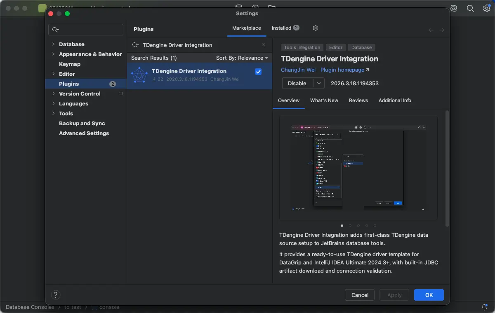
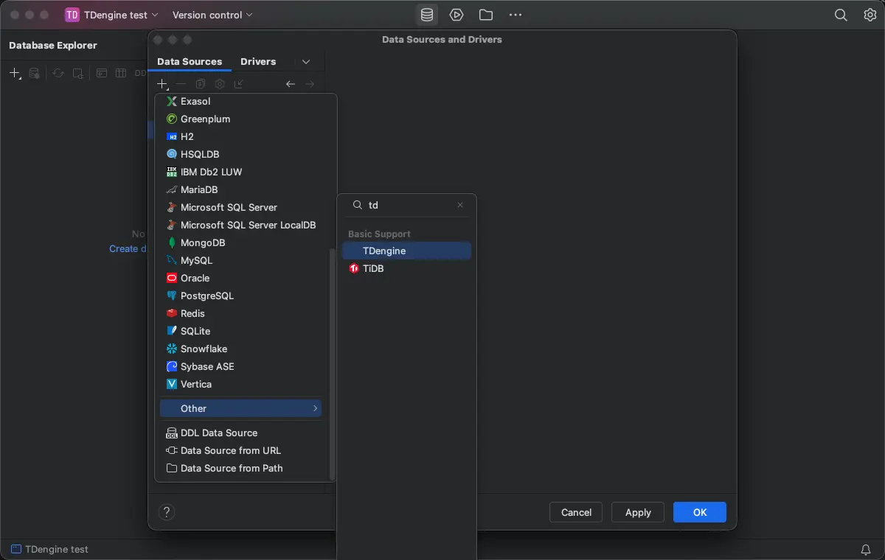
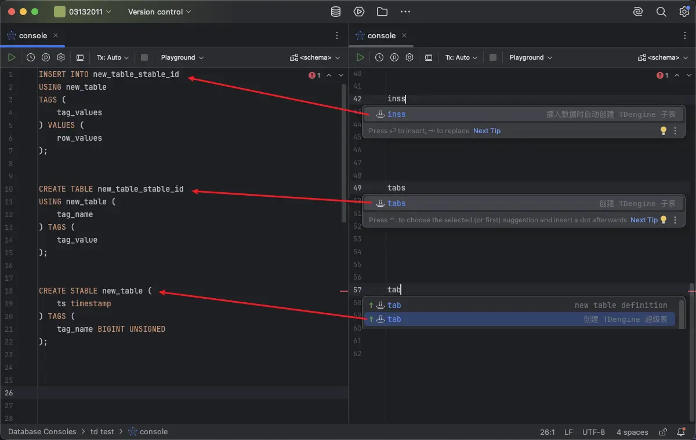

# JetBrains

The TDengine Driver Integration plugin enhances JetBrains IDEs with TDengine data source setup, driver download, and SQL dialect support. It is compatible with JetBrains IDEs 2024.3 and later.

## Prerequisites

- Install [DataGrip or a JetBrains IDE/edition that includes Database Tools](https://www.jetbrains.com/products/?lang=sql), version 2024.3 or later.
- Install the [TDengine Driver Integration](https://plugins.jetbrains.com/plugin/30538-tdengine-driver-integration) plugin.

## Install the Plugin

1. Open your JetBrains IDE.
2. Go to `Settings` -> `Plugins`.
3. Search for `TDengine Driver Integration`.
4. Install the plugin and restart the IDE.

## Connect to TDengine

1. In DataGrip or a supported JetBrains IDE/edition 2024.3 or later, open the `Database` tool window.
2. Click `+` and choose `Data Source`.
3. Select `TDengine` from the data source list.
4. Download the built-in TDengine JDBC Driver as needed.
5. Configure the connection parameters, such as the JDBC URL, username, password, and default database, and test the connection.

The plugin validates the following settings:

- JDBC Driver Class
- JDBC URL prefix
- Host
- Port
- Default database

## SQL Development Support

After installing the plugin, the TDengine SQL Console provides the following features:

- TDengine keyword completion
- TDengine function completion
- Function highlighting
- Function parameter info
- Function hover documentation
- Comments and basic syntax highlighting
- `SHOW CREATE DATABASE` / `SHOW CREATE TABLE` definition view
- Live Templates

