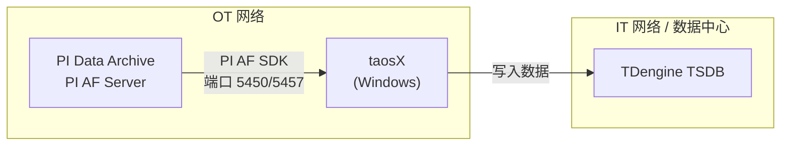
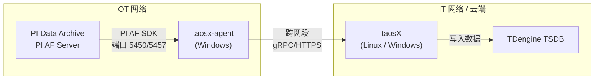
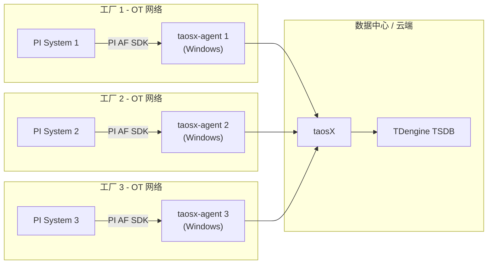

本页介绍 PI 连接器的部署架构选型，帮助你根据实际的网络环境选择合适的部署方案。

## 1. 架构概述

PI 连接器是 taosX 的一个插件，负责从 PI 系统读取数据并写入 TDengine。其核心依赖为 **PI AF SDK**（仅支持 Windows），因此连接器必须运行在可直连 PI 系统的 Windows 主机上。

连接器有两种运行方式：

| 运行方式 | 说明 |
| --- | --- |
| 内嵌于 taosX | taosX 本身部署在可直连 PI 系统的 Windows 主机上，连接器作为 taosX 的内置插件运行 |
| 通过 taosx-agent 代理 | taosX 部署在其他位置（如云端或 IT 数据中心），通过 taosx-agent 代理访问 PI 系统 |

## 2. 方案 A：taosX 直连

**适用场景**：taosX 可以直接部署在与 PI 系统同一网段的 Windows 服务器上。

**优点**：

- 架构简单，无需额外部署 agent
- 运维成本低

**限制**：

- taosX 必须运行在 Windows 上
- taosX 所在主机必须同时能连通 PI 系统和 TDengine

## 3. 方案 B：Agent 代理模式（推荐）

**适用场景**：taosX 部署在云端或 IT 数据中心，无法直连 PI 系统；或者 PI 系统位于隔离的 OT 网络中。

**优点**：

- taosX 可以部署在 Linux 上，不受 PI AF SDK 的 Windows 限制
- 符合 OT/IT 网络分区的安全要求
- agent 只需要与 PI 系统和 taosX 两个方向的网络连通

**限制**：

- 需要额外部署和维护 taosx-agent
- agent 所在的 Windows 主机必须安装 PI AF SDK

:::tip
Agent 代理模式是**生产环境的推荐部署方案**，尤其适合 OT/IT 网络隔离的工业场景。
:::

## 4. 方案 C：多 PI 系统汇聚

**适用场景**：集团级部署，多个工厂各有独立的 PI 系统，需要将数据汇聚到统一的 TDengine 集群。

**优点**：

- 统一管理多个 PI 系统的数据
- 每个工厂独立部署 agent，互不影响
- 便于集团级数据分析和监控

**注意事项**：

- 每个 agent 需要独立安装 PI AF SDK 并配置对应 PI 系统的访问权限
- 建议为不同工厂的数据使用不同的 TDengine 数据库或超级表前缀，避免命名冲突

## 5. Agent 部署要点

如果你选择了方案 B 或方案 C，以下是 taosx-agent 部署时的关键要点：

| 要点 | 说明 |
| --- | --- |
| 操作系统 | 必须为 Windows（PI AF SDK 仅支持 Windows） |
| PI AF SDK | 必须在 agent 主机上安装 PI AF SDK（PI AF Client 2018+） |
| 服务账户 | agent 运行的 Windows 服务账户必须有 PI 系统的访问权限 |
| 网络 - PI 侧 | agent → PI Data Archive（端口 5450）、agent → PI AF Server（端口 5457） |
| 网络 - taosX 侧 | agent ↔ taosX 之间的网络连通（gRPC/HTTPS） |
| 安装方式 | 在 Explorer 中点击 **+创建新的代理** 可获取 agent 的安装指引 |

## 6. 架构选型决策表

| 条件 | 推荐方案 |
| --- | --- |
| taosX 可以部署在 PI 系统同一网段的 Windows 主机 | 方案 A（直连） |
| taosX 在云端或 IT 网络，PI 在 OT 网络 | 方案 B（Agent 代理） |
| 多个工厂的 PI 系统需要汇聚到同一个 TDengine | 方案 C（多 PI 汇聚） |
| OT/IT 网络严格隔离，有安全合规要求 | 方案 B 或 C（Agent 代理） |
| 希望 taosX 运行在 Linux 上 | 方案 B 或 C（Agent 代理） |
