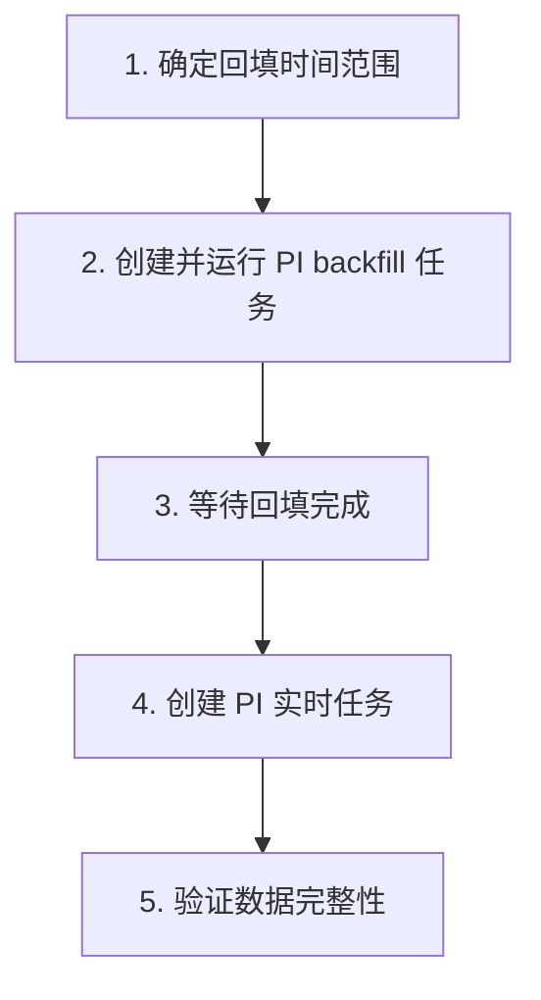
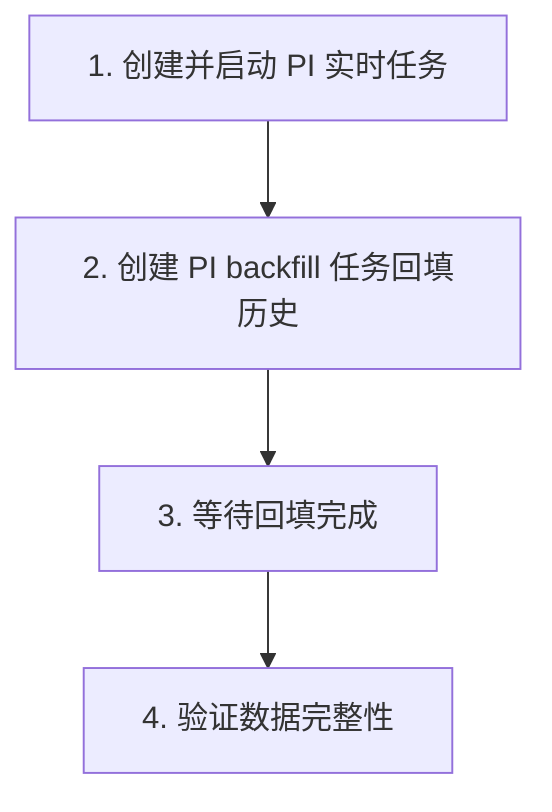

本页介绍如何使用 PI backfill 任务将 PI 系统中的历史数据迁移到 TDengine，涵盖任务创建、性能优化、迁移流程和数据验证。

## 1. 概述

PI backfill 任务用于按指定时间范围提取 PI 系统的历史数据并写入 TDengine。典型使用场景包括：

- **系统切换**：从 PI 系统迁移到 TDengine，需要将历史数据一并迁移
- **数据补录**：因任务中断或其他原因导致的数据缺失，需要回填一段时间的数据
- **数据分析**：将历史数据导入 TDengine 进行回顾性分析

## 2. 创建 PI backfill 任务

### 2.1 基本步骤

1. 在 Explorer 的数据写入页面，点击 **+新增数据源**
2. 在 **类型** 下拉列表中选择 **PI backfill**
3. 配置连接信息（与实时任务相同，详见 [主文档](./index.md)）
4. 配置数据模型（单列/多列，详见 [模型配置参考](./03-csv-reference.md)）
5. 配置回填时间范围（见下节）
6. 提交任务

### 2.2 配置回填时间范围

PI backfill 任务**必须**配置以下参数：

| 参数 | 说明 |
| --- | --- |
| 开始时间 | 回填数据的起始时间点 |
| 结束时间 | 回填数据的截止时间点 |


:::note
回填任务在完成指定时间范围的数据迁移后会自动停止。
:::

## 3. 性能优化

### 3.1 批次大小调优

在 **高级选项** 中可以调整批次大小，影响每次向 TDengine 写入的数据量：

| 场景 | 建议批次大小 | 说明 |
| --- | --- | --- |
| 默认 | 使用系统默认值 | 适合大多数场景 |
| 大量点位、数据密集 | 适当增大 | 提高吞吐量，但占用更多内存 |
| 内存受限 | 适当减小 | 降低内存占用，但可能降低吞吐量 |

### 3.2 并行回填策略

对于大量历史数据的迁移，建议按时间段拆分为多个 backfill 任务并行执行：

| 策略 | 说明 |
| --- | --- |
| 按年/月拆分 | 将整个回填时间范围按年或月拆分为多个任务 |
| 按数据源拆分 | 不同的模板或点位组使用独立的回填任务 |
| 控制并发数 | 注意 PI 系统和 TDengine 的负载，避免过多并行任务 |

**示例**：回填 2020-01-01 至 2024-12-31 的数据

```text
任务 1: 2020-01-01 ~ 2020-12-31
任务 2: 2021-01-01 ~ 2021-12-31
任务 3: 2022-01-01 ~ 2022-12-31
任务 4: 2023-01-01 ~ 2023-12-31
任务 5: 2024-01-01 ~ 2024-12-31
```

:::tip
并行回填时，请关注 PI Data Archive Server 的负载情况，避免因过多并发读取影响 PI 系统的正常运行。
:::

### 3.3 对 PI 系统的性能影响

回填任务会从 PI Data Archive 大量读取历史数据，可能对 PI 系统产生以下影响：

- 增加 PI Data Archive 的 CPU 和 I/O 负载
- 增加网络带宽占用

**缓解措施**：

- 在 PI 系统负载较低的时段（如夜间、周末）执行回填
- 控制并行任务数量
- 通过批次大小参数控制读取速率

## 4. 推荐迁移流程

### 4.1 先回填后实时（推荐）

这是最常见的迁移流程，适合大多数场景：



**关键点**：

- 步骤 4 中创建实时任务时，配置适当的**重启补偿时间**，覆盖回填完成到实时任务启动之间的时间间隔，确保过渡期无数据丢失
- 步骤 5 建议对比 PI 和 TDengine 的数据量，并抽样检查数据准确性

### 4.2 先实时后回填

适用于需要尽快开始实时数据同步的场景：



**关键点**：

- TDengine 对相同时间戳的数据会进行更新（覆盖写入），因此实时任务和回填任务写入的时间重叠部分不会产生重复数据
- 这种方式的优势是实时数据不会有延迟，缺点是回填期间的 PI 系统和 TDengine 负载会更高

## 5. 数据验证

回填完成后，建议进行以下验证：

### 5.1 数据量对比

在 PI 和 TDengine 中分别查询同一时间范围的数据量，确认一致：

```sql
-- TDengine：查询某张表在回填时间范围内的数据量
SELECT COUNT(*) FROM <table_name>
WHERE ts >= '2020-01-01' AND ts < '2025-01-01';
```

### 5.2 数据准确性抽样

选取若干个点位/元素，对比 PI 和 TDengine 中特定时间点的数据值是否一致。

### 5.3 时间戳对齐

确认 TDengine 中的时间戳与 PI 中的原始时间戳一致，特别关注时区问题。

## 6. 常见问题

### 回填任务中断后如何续传？

PI backfill 任务支持断点续传。如果任务中断，重新启动后会从上次中断的位置继续回填，已写入的数据不会重复处理。

### 大规模点位回填的分批策略？

如果需要回填上万个点位的数据，建议：

1. 按模板/点位组拆分为多个任务
2. 每个任务使用独立的模型配置文件
3. 分批启动，监控 PI 系统负载

### 回填速度慢如何排查？

1. 检查网络带宽是否是瓶颈
2. 查看 PI Data Archive 的 CPU 和 I/O 负载
3. 检查 TDengine 写入是否成为瓶颈
4. 尝试调整批次大小参数
5. 将日志级别调整为 `debug` 查看详细信息
