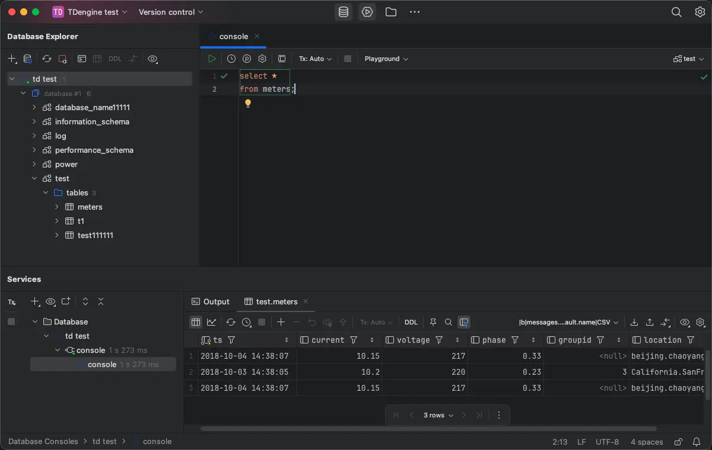

# JetBrains

TDengine Driver Integration 插件为 JetBrains IDE 提供 TDengine 数据源设置、驱动程序下载和 SQL 方言支持方面的增强功能。它与 JetBrains IDE 2024.3 及更高版本兼容。

## 前置条件

- 已安装 [DataGrip 或包含 Database Tools 的 JetBrains IDE/版本](https://www.jetbrains.com/products/?lang=sql)，版本为 2024.3 或更高版本。
- 已安装 [TDengine Driver Integration](https://plugins.jetbrains.com/plugin/30538-tdengine-driver-integration) 插件。

## 安装插件

1. 打开 JetBrains IDE。
2. 进入 `Settings` -> `Plugins`。
3. 搜索 `TDengine Driver Integration`。
4. 安装插件并重启 IDE。

## 连接 TDengine

1. 在 DataGrip 或受支持的 2024.3 及以上版本 JetBrains IDE/版本中，打开 `Database` 工具窗口。
2. 点击 `+`，选择 `Data Source`。
3. 在数据源列表中选择 `TDengine`。
4. 按需下载插件内置的 TDengine JDBC Driver。
5. 配置连接参数，例如 JDBC URL、用户名、密码和默认数据库，并测试连接。

插件会对以下配置进行校验：

- JDBC Driver Class
- JDBC URL 前缀
- Host
- Port
- 默认数据库

## SQL 开发支持

安装插件后，在 TDengine SQL Console 中可获得以下能力：

- TDengine 关键字补全
- TDengine 函数补全
- 函数高亮
- 函数参数提示
- 函数悬停文档
- 注释与基础语法高亮
- `SHOW CREATE DATABASE` / `SHOW CREATE TABLE` 定义查看
- Live Templates

