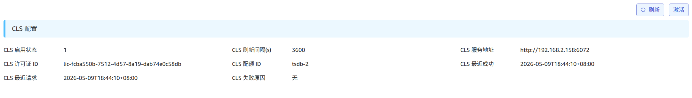
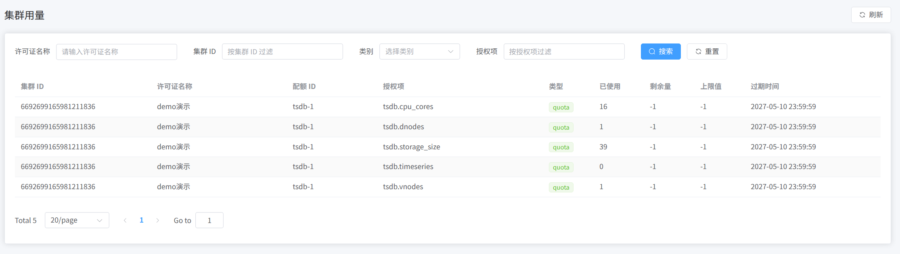

License Center 是一个用于管理 TDengine TSDB / IDMP 授权的服务，包含中心侧的 ELS (Enterprise License Server) 管理端和本地侧的 CLS (Customer License Server) 管理端。ELS 主要部署在 TDengine 服务商，CLS 是在客户本地部署。本文以本地已部署的 CLS 为例，介绍授权的完整操作流程（注意本文档中所有涉及的 ID 以及许可证均为测试展示使用，无实际意义）。

## 前置条件

### 部署安装

安装包：

```bash
license-center-cls-0.1.0-linux-amd64.tar.gz
```

解压后即可看到部署相关脚本：

```bash
scripts/
├── install.sh
├── start.sh
├── status.sh
├── stop.sh
└── uninstall.sh
```

执行 install.sh，start.sh 后即可启动服务。

### 配置信息

默认配置文件在 `/etc/taoscls/taoscls.toml`:

```toml
[local]
# 服务监听的地址，默认 0.0.0.0 表示监听所有网卡地址
listen = "0.0.0.0"
# 开启 HTTP API 服务端口
http_port = 6072
# 与 ELS 服务通信端口
rpc_port = 6073

[els]
# ELS 服务的地址
host = "localhost"
# ELS 服务的端口
port = 8094
# 是否开启与 ELS 的通信
enable = true

[database]
# 数据存放路径
path = "/var/lib/taoscls"

[log]
# 日志级别
level = "info"
# 日志路径
file = "/var/log/taoscls/taoscls.log"
```

### 本地访问

- 在本地启动 CLS 服务，浏览器访问：
  - CLS: `http://localhost:6072`
- 本文示例中的本地体验账号均为：
  - 用户名：`root`
  - 密码：`taosdata`

## 服务信息

1. 启动完成后，在浏览器中打开 CLS 管理端并登录。

2. 登录后，可在**本机信息**页面查看到**公钥令牌**等信息，如下图所示：


## 离线授权

### 1. 获取许可证

将 CLS **本机信息**页面中的**公钥令牌**交予 TDengine 服务商，服务商将会返回许可证文件 `offline-license.token`。

### 2. 导入许可证

在 CLS 的**许可证**页面，点击右上角**离线导入**，选择 `offline-license.token`，然后点击**导入**。导入成功后，许可证会出现在 CLS 的**许可证**页面列表中。

### 3. 查看配额

进入左侧**配额**页面，可以查看该许可证拆分后的配额和授权项明细，包括许可证 ID、配额 ID、授权项、类别、类型、值和过期时间。


## 在线授权

在线授权与离线授权的整体流程基本一致，区别在于授权许可证的获取方式。在线模式下，若 CLS 已连接 ELS，ELS 侧授权后许可证将自动同步至 CLS；离线模式则需通过文件等离线方式手动导入许可证。

## 连接 CLS

当前 TSDB/IDMP 集群均可通过相关配置与 CLS 通信，且在 CLS 集群管理的相关页面可看到具体信息。

### TSDB 配置

TSDB 连接 CLS 服务可使用 taosExplorer 页面进行配置，也可以使用 TSDB 的 SQL 指令进行配置。

#### taosExplorer

在 taosExplorer 组件的**系统管理/许可证**页面，点击**激活许可证**按钮后，可以看到如下配置页面：


配置字段的含义与下文中的 SQL 配置参数一致。点击确定后，许可证页面即可看到 CLS 配置信息：



#### SQL

TSDB 可以使用如下 SQL 指令配置 CLS 服务相关信息，示例如下：

```sql
ALTER ALL DNODES 'clsEnabled' '1';
ALTER ALL DNODES 'clsRefreshInterval' '15';
ALTER ALL DNODES 'clsUrl' 'http://192.168.2.158:6072';
ALTER ALL DNODES 'clsLicenseId' 'lic-53467044-2dad-4be2-9280-adacb201a644';
ALTER ALL DNODES 'clsQuotaSlotId' 'tsdb-1';
```

说明：

`clsEnabled`: 表示是否开启 CLS 许可证功能

`clsRefreshInterval`: 表示与 CLS 服务通信间隔

`clsUrl`: 表示 CLS 服务地址

`clsLicenseId`: 表示要获取的许可证 ID

`clsQuotaSlotId`: 表示要获取的配额 ID

### IDMP 配置

当前新版本的页面配置正在开发中，敬请期待。

### CLS 集群管理

在 TSDB/IDMP 进行 CLS 配置后，即可在 CLS 的**集群**页面上看到对应的集群信息：


在**集群用量**页面上即可看到具体授权项的用量信息：


